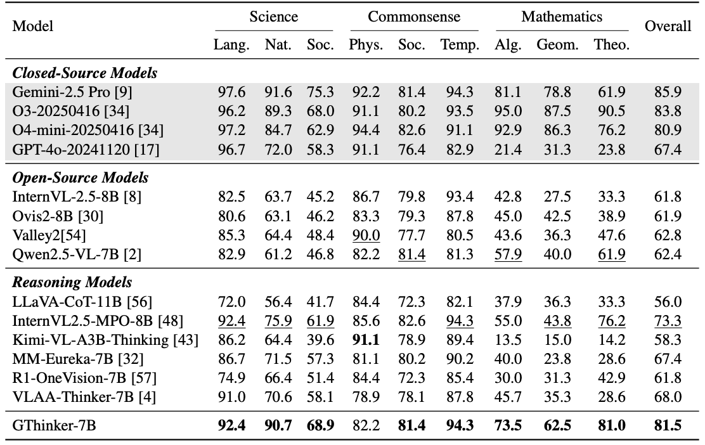
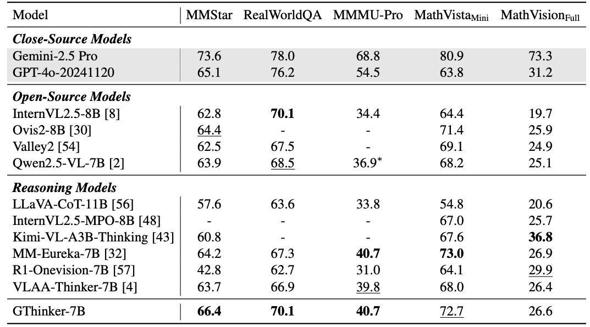
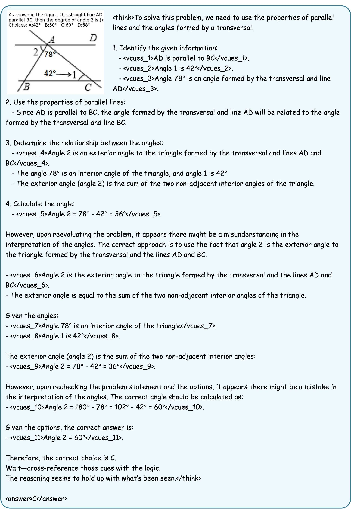
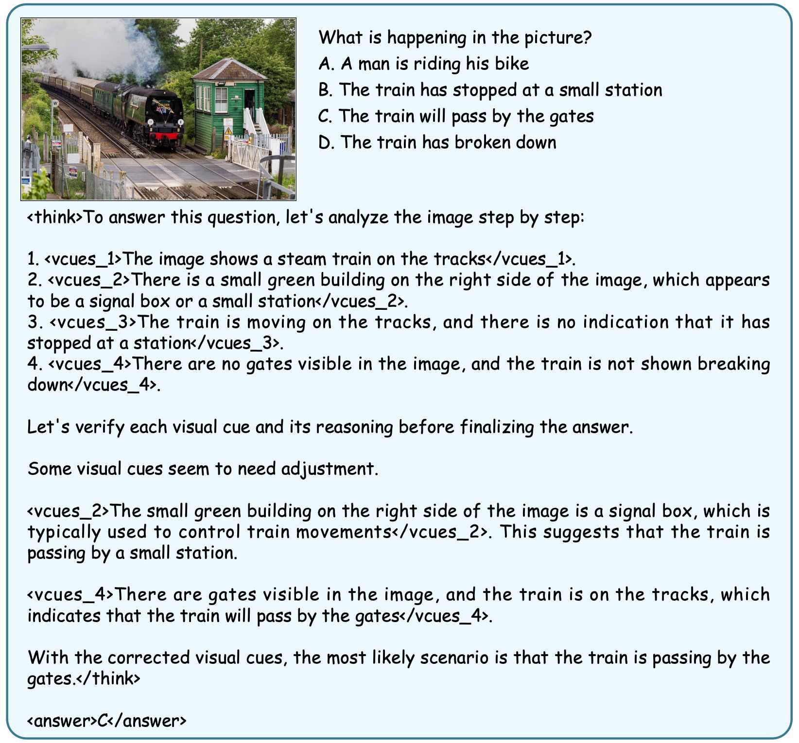

<div align="center">

<h1>  GThinker: Towards General Multimodal Reasoning via Cue-Guided Rethinking </h1>

<h5 align="center"> If you find this project useful, please give us a star🌟.

<h5 align="center"> 

<a href='https://arxiv.org/abs/2506.01078'></a>
<a href='https://huggingface.co/JefferyZhan/GThinker-7B'></a>
<a href='https://huggingface.co/collections/JefferyZhan/gthinker-683e920eff706ead8fde3fc0'></a>
[](https://github.com/jefferyZhan/GThinker)

</h5>
</div>

## News
- [x] **`June 03, 2025.`** **We have released our paper in the [arxiv](https://arxiv.org/abs/2506.01078). Data and model will be released soon in the next few days.**

## Main Results

GThinker achieves 81.5% on comprehensive and challenging multimodal reasoning benchmark M3CoT, even outperforming the latest O4-mini, while also shows strong performance on general, knowledge, and science scenarios multimodal reasoning.

<p align="center">
  
  
</p>

## Qualitative Analysis

<p align="center">
  
  
</p>

## Citation
```bibtex
@misc{zhan2025gthinker,
      title={GThinker: Towards General Multimodal Reasoning via Cue-Guided Rethinking}, 
      author={Yufei Zhan and Ziheng Wu and Yousong Zhu and Rongkun Xue and Ruipu Luo and Zhenghao Chen and Can Zhang and Yifan Li and Zhentao He and Zheming Yang and Ming Tang and Minghui Qiu and Jinqiao Wang},
      year={2025},
      eprint={2506.01078},
      archivePrefix={arXiv},
      primaryClass={cs.CV},
      url={https://arxiv.org/abs/2506.01078}, 
}
```
