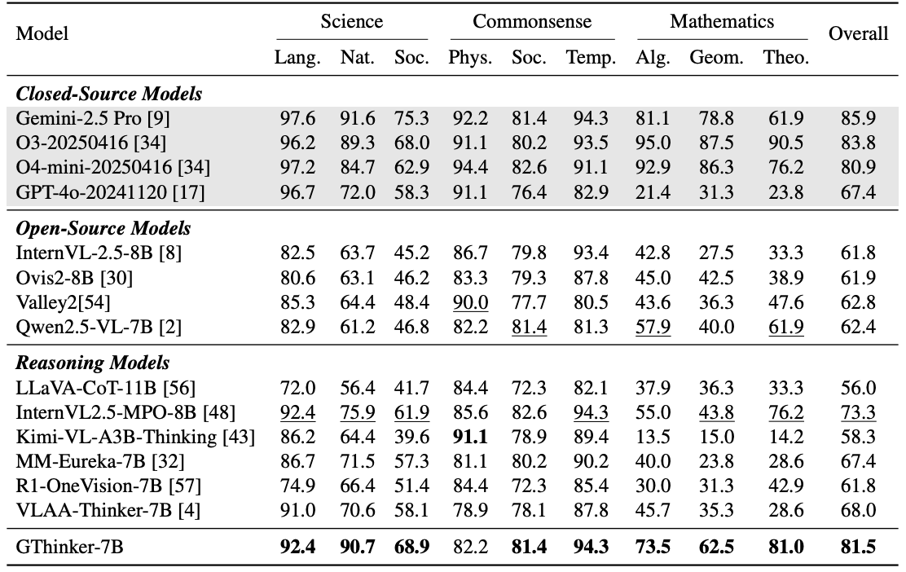
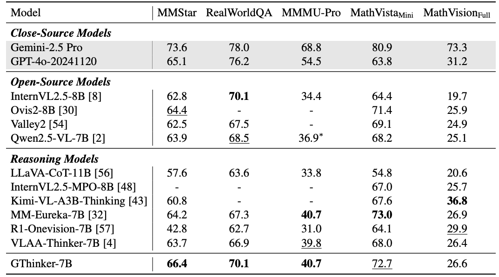
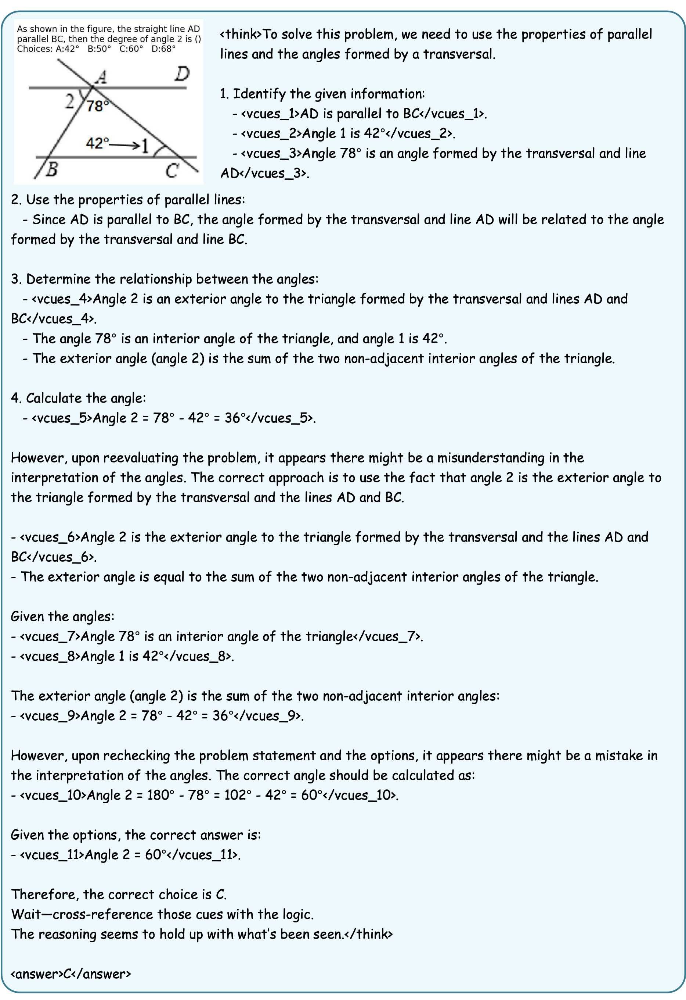
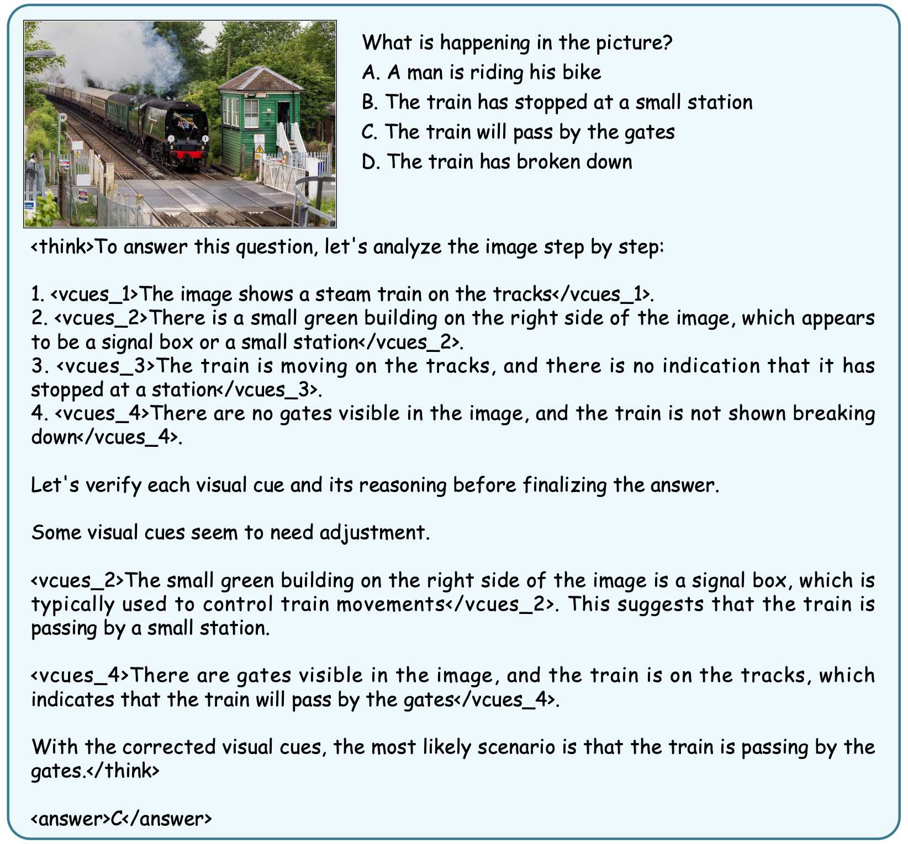

<div align="center">
  
<h1> GThinker: Towards General Multimodal Reasoning via Cue-Guided Rethinking </h1>

**[Yufei Zhan](https://scholar.google.com/citations?user=RvHqTGEAAAAJ&hl=en)**<sup>†</sup>, **[Ziheng Wu](https://scholar.google.com/citations?user=dxz-OP0AAAAJ&hl=zh-CN)**<sup>†</sup>, **Yousong Zhu**<sup>✉</sup>, **Rongkun Xue**, **Guanghao Zhou**, **Ruipu Luo**, **Zhenghao Chen**, **Can Zhang**, **Yifan Li**, **Zhentao He**, **Zheming Yang**, **Ming Tang**, **Minghui Qiu**, **Jinqiao Wang**<sup>✉</sup>

<sup>†</sup>Equal Contribution &nbsp;&nbsp;&nbsp;&nbsp;&nbsp; <sup>✉</sup>Corresponding Author

<h5 align="center"> If you find this project useful, please give us a star🌟.</h5>

<div align="center">
  <a href='https://arxiv.org/abs/2506.01078'></a>
  <a href='https://huggingface.co/JefferyZhan/GThinker-7B'></a>
  <a href='https://huggingface.co/collections/JefferyZhan/gthinker-683e920eff706ead8fde3fc0'></a>
  <a href='https://github.com/jefferyZhan/GThinker'></a>
</div>

</div>

## 📰 News
- **[2026.03]** 🎉 **Exciting News!** Our paper has been accepted to **CVPR 2026 (Main)**! The training code is now fully released.
- **[2025.07]** 🚀 We have released the [Dataset](https://huggingface.co/collections/JefferyZhan/gthinker-683e920eff706ead8fde3fc0) and [Model weights](https://huggingface.co/JefferyZhan/GThinker-7B) on HuggingFace.
- **[2025.06]** 📄 We released our paper [GThinker](https://arxiv.org/abs/2506.01078) on arXiv. Data and model will be released soon.

## 🚀 Main Results
GThinker achieves **81.5%** on the comprehensive and challenging multimodal reasoning benchmark M3CoT, even outperforming the latest O4-mini. It also shows strong performance on general, knowledge, and science multimodal reasoning scenarios.

<p align="center"> 
   
   
</p> 

## 👁️ Qualitative Analysis
<p align="center"> 
   
   
</p> 

## ⚙️ Training

### 1. Environment Installation
First, clone the repository and install the dependencies. *(Note: The Python `trl` library may need to be installed separately depending on your environment).*

```bash
git clone https://github.com/jefferyZhan/GThinker.git
cd GThinker/EasyR1
pip install -e .
# pip install trl # uncomment if needed
```

### 2. Cold Start
The cold start phase requires an 8-GPU node. You can modify the saving configurations and other parameters in `SFT_code/GThinker_SFT_config.yaml`.

Run the following commands from the repository root:
```bash
cd SFT_code
accelerate launch --config_file zero2.yaml GThinker_SFT.py --config GThinker_SFT_config.yaml
```

### 3. Reinforcement Learning
For the RL phase, we utilized 4 nodes. First, configure the multi-node setup following the [verl official documentation](https://github.com/volcengine/verl). Once configured, submit the Ray job:

```bash
cd EasyR1
ray job submit --address="http://127.0.0.1:8265" \
  --runtime-env=verl/trainer/runtime_env.yaml \
  --no-wait \
  -- python3 -m verl.trainer.main config=examples/gthinker-7B.yaml
```

## 📊 Evaluation
We evaluate our model using [VLMEvalKit](https://github.com/open-compass/VLMEvalKit). 
To evaluate GThinker, simply follow the setup for the **Qwen2.5-VL** model and configure the corresponding **System Prompt**.

## 📝 Citation
If you find our work helpful, please consider citing our paper:
```bibtex
@misc{zhan2025gthinker,
      title={GThinker: Towards General Multimodal Reasoning via Cue-Guided Rethinking}, 
      author={Yufei Zhan and Ziheng Wu and Yousong Zhu and Rongkun Xue and Ruipu Luo and Zhenghao Chen and Can Zhang and Yifan Li and Zhentao He and Zheming Yang and Ming Tang and Minghui Qiu and Jinqiao Wang},
      year={2025},
      eprint={2506.01078},
      archivePrefix={arXiv},
      primaryClass={cs.CV},
      url={https://arxiv.org/abs/2506.01078}, 
}
}
```
